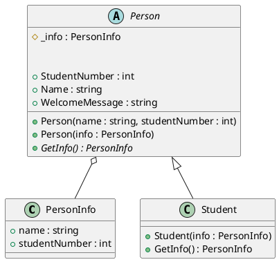

# lab 1

## UML



## classes:

### Person
```csharp 
internal record PersonInfo(string name,int studentNumber);
internal abstract class Person
{
    #region FIELDS
    protected PersonInfo _info;
    #endregion
    public Person(string name, int studentNumber)
    {
        _info = new PersonInfo(name, studentNumber);
    }
    public Person(PersonInfo info)
    {
        _info = info;
    }
    #region accesors
    public int StudentNumber => _info.studentNumber;
    public string Name => _info.name;

    public string WelcomeMessage => $"Hello {Name}";
    #endregion

    #region methods
    abstract public PersonInfo GetInfo();
    #endregion
}
```

### Student

```csharp
internal class Student : Person
{
    public Student(PersonInfo info) : base(info)
    {

    }
    public override PersonInfo GetInfo()
    {
        return _info;
    }
}
```