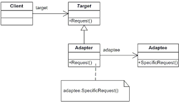

# adapter



the adapter panel is used for when two interface are incompatible with each other, mostly used to make legacy code work with newer classes.

## Target

> the `Target` defines the `domain specific interface` used by the `client`

```csharp
public interface ITarget
{
    string GetRequest();
}
```

## Adaptee

> Billy's legacy DO NOT TOUCH class we need.
>
> but the `interface is incompatible`

```csharp
class Adaptee
{
    public string GetSpecificRequest()
    {
        return "Specific request.";
    }
}
```

## Adapter

> The adapter `implements` the `target interface` and `converts the Adaptee interface`

```csharp
class Adapter : ITarget
{
    private readonly Adaptee _adaptee;

    public Adapter(Adaptee adaptee)
    {
        this._adaptee = adaptee;
    }

    public string GetRequest()
    {
        return $"This is '{this._adaptee.GetSpecificRequest()}'";
    }
}
```