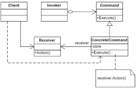

# command pattern



## Command Interface

```csharp
public interface ICommand
{
    void Execute();
}
```

## Simple Command

```csharp
class SimpleCommand : ICommand
{
    private string _payload = string.Empty;

    public SimpleCommand(string payload)
    {
        this._payload = payload;
    }

    public void Execute()
    {
        Console.WriteLine($"SimpleCommand: See, I can do simple things like printing ({this._payload})");
    }
}
```


## Command Invoker

> the invoker `invokes/executes the commands`

```csharp
class Invoker
{
    private ICommand _onStart;

    private ICommand _onFinish;

    // Initialize commands.
    public void SetOnStart(ICommand command)
    {
        this._onStart = command;
    }

    public void SetOnFinish(ICommand command)
    {
        this._onFinish = command;
    }

    // The Invoker does not depend on concrete command or receiver classes.
    // The Invoker passes a request to a receiver indirectly, by executing a
    // command.
    public void DoSomethingImportant()
    {
        Console.WriteLine("Invoker: Does anybody want something done before I begin?");
        if (this._onStart is ICommand)
        {
            this._onStart.Execute();
        }
        
        Console.WriteLine("Invoker: ...doing something really important...");
        
        Console.WriteLine("Invoker: Does anybody want something done after I finish?");
        if (this._onFinish is ICommand)
        {
            this._onFinish.Execute();
        }
    }
}
```