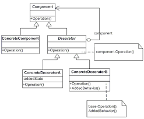

# decorator



## Component

>  The `base Component interface defines operations` that can be `altered` by decorators.

```csharp
public abstract class Component
{
    public abstract string Operation();
}
```

## Decorator

> the decorator class implements the Component class and allows setting a base component

```csharp
abstract class Decorator : Component
{
    protected Component _component;

    public Decorator(Component component)
    {
        this._component = component;
    }

    public void SetComponent(Component component)
    {
        this._component = component;
    }

    // The Decorator delegates all work to the wrapped component.
    public override string Operation()
    {
        if (this._component != null)
        {
            return this._component.Operation();
        }
        else
        {
            return string.Empty;
        }
    }
}
```