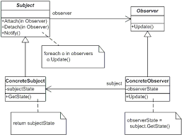

# observer



## interfaces

### Observer Interface

The observer interface contains the subject update function

The `update function` gets `called` when the `Subject notifies Observers`.

```csharp
public interface IObserver
{
    // Receive update from subject
    void Update(ISubject subject);
}
```

### Subject Interface

```csharp
public interface ISubject
{
    // Attach an observer to the subject.
    void Attach(IObserver observer);

    // Detach an observer from the subject.
    void Detach(IObserver observer);

    // Notify all observers about an event.
    void Notify();
}
```

### Subject Implementation

```csharp
public class Subject : ISubject
{
    // For the sake of simplicity, the Subject's state, essential to all
    // subscribers, is stored in this variable.
    public int State { get; set; } = -0;

    // List of subscribers. In real life, the list of subscribers can be
    // stored more comprehensively (categorized by event type, etc.).
    private List<IObserver> _observers = new List<IObserver>();

    // The subscription management methods.
    public void Attach(IObserver observer)
    {
        Console.WriteLine("Subject: Attached an observer.");
        this._observers.Add(observer);
    }

    public void Detach(IObserver observer)
    {
        this._observers.Remove(observer);
        Console.WriteLine("Subject: Detached an observer.");
    }

    // Trigger an update in each subscriber.
    public void Notify()
    {
        Console.WriteLine("Subject: Notifying observers...");

        foreach (var observer in _observers)
        {
            observer.Update(this);
        }
    }

    // Usually, the subscription logic is only a fraction of what a Subject
    // can really do. Subjects commonly hold some important business logic,
    // that triggers a notification method whenever something important is
    // about to happen (or after it).
    public void SomeBusinessLogic()
    {
        Console.WriteLine("\nSubject: I'm doing something important.");
        this.State = new Random().Next(0, 10);

        Thread.Sleep(15);

        Console.WriteLine("Subject: My state has just changed to: " + this.State);
        this.Notify();
    }
}
```


### Observer Implementation

These observers react to th notify of the subject.

````csharp
class ConcreteObserverA : IObserver
{
    public void Update(ISubject subject)
    {            
        if ((subject as Subject).State < 3)
        {
            Console.WriteLine("ConcreteObserverA: Reacted to the event.");
        }
    }
}
```