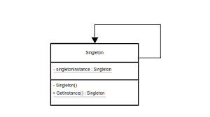

# singleton



> [!NOTE] 
> the singleton class needs to be `sealed` to `prevent inheritance`

```csharp
public sealed class Singleton
{
    // The Singleton's constructor should always be private to prevent
    // direct construction calls with the `new` operator.
    private Singleton() { }

    // The Singleton's instance is stored in a static field. There there are
    // multiple ways to initialize this field, all of them have various pros
    // and cons. In this example we'll show the simplest of these ways,
    // which, however, doesn't work really well in multithreaded program.
    private static Singleton _instance;

    // This is the static method that controls the access to the singleton
    // instance. On the first run, it creates a singleton object and places
    // it into the static field. On subsequent runs, it returns the client
    // existing object stored in the static field.
    public static Singleton GetInstance()
    {
        if (_instance == null)
        {
            _instance = new Singleton();
        }
        return _instance;
    }

    // Finally, any singleton should define some business logic, which can
    // be executed on its instance.
    public void someBusinessLogic()
    {
        // ...
    }
}
```

> [!NOET]
> the above implementatio is not thread save, this can be solved by wrapping the instance creation in a lock.

```csharp
private static readonly object _lock = new object();
lock (_lock)
{
    // The first thread to acquire the lock, reaches this
    // conditional, goes inside and creates the Singleton
    // instance. Once it leaves the lock block, a thread that
    // might have been waiting for the lock release may then
    // enter this section. But since the Singleton field is
    // already initialized, the thread won't create a new
    // object.
    if (_instance == null)
    {
        _instance = new Singleton();
        _instance.Value = value;
    }
}

```