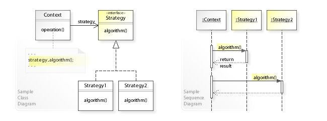

# strategy



> It’s often `used` in various `frameworks` to provide users a way to `change the behavior` of a `class without extending it`.

## IStrategy

> The Strategy `interface` declares `operations common` to all supported `versions of some algorithm`.
> 
> The `Context uses` this `interface to call the algorithm` defined by Concrete Strategies.
> 
```csharp
public interface IStrategy
{
    object DoAlgorithm(object data);
}

```

## Strategy Implementation

`Concrete Strategies implement` the `algorithm` while **following** the **base Strategy interface**. The interface makes them interchangeable in the Context.

```csharp
class ConcreteStrategyA : IStrategy
{
    public object DoAlgorithm(object data)
    {
        var list = data as List<string>;
        list.Sort();

        return list;
    }
}
```

## Context

The Context `defines` the `interface` of interest to `clients`.

```csharp
class Context
{
    // The Context maintains a reference to one of the Strategy objects. The
    // Context does not know the concrete class of a strategy. It should
    // work with all strategies via the Strategy interface.
    private IStrategy _strategy;

    public Context()
    { }

    // Usually, the Context accepts a strategy through the constructor, but
    // also provides a setter to change it at runtime.
    public Context(IStrategy strategy)
    {
        this._strategy = strategy;
    }

    // Usually, the Context allows replacing a Strategy object at runtime.
    public void SetStrategy(IStrategy strategy)
    {
        this._strategy = strategy;
    }
    public void DoSomeBusinessLogic()
    {
        //use the provided strategy
    }
};

```
