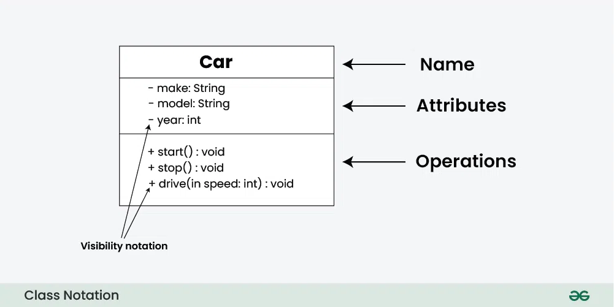

# class diagrams

## Class

- `Describes` a collection of objects with similar
- `Defines` object structure:
  - Attributes
  - Methods

## Class Diagram

defines classes and their relations and inter dependencies

### representation



| symbol | meaning                            |
| :----- | :--------------------------------- |
| +      | **public**                         |
| -      | **private**                        |
| #      | **protected** class->derived class |
| ~      | **Package**                        |

### Attributes

```
[visibility][/]naam[:type][[multiplicity]] [=standaardwaarde][{property, 
beperkingen, mogelijkewaarden}]

```